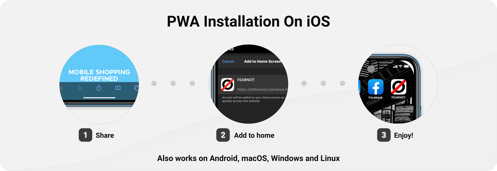

# Spree 2 Vue Storefront [spree2vs]

spree2vs bridges two open source initiatives into a complete e-commerce platform. It combines [Spree][3]'s inventory and order management capabilities with [Vue Storefront][4]'s modern approach to consumer online shopping experiences.

An increasingly influential feature of the platform is support for Progressive Web App ([PWA][2]) technologies. They allow *installing* a store's website on consumer devices and interacting with it just like with native apps. In this form, the store is listed among other apps for easier access and can utilize extra resources unlocked for it by the device. For example, it may retain more data on the phone to provide a faster and smoother product browsing experience. PWAs are supported on all major mobile and desktop operating systems.

Visit the [Fearnot Demo Site][1] to test the platform and check how installing a web app works in practice.

## Architecture

Here's where spree2vs fits in the tech stack:

Part | Role 
---------|----------
Spree&nbsp;2&nbsp;Vue&nbsp;Storefront | Translates requests between Spree and Vue Storefront and imports information about products and categories from Spree to Elastic Search for consumption by Vue Storefront.
Spree | Manages products` catalog and orders. Is the "back office" portion of the tech stack. It makes sure products are available, orders can be placed, paid for and fulfilled.
Vue&nbsp;Storefront | Provides end user experience by serving an installable website. It's the "front office" of the stack.
Vue&nbsp;Storefront&nbsp;API | Normalizes communication between e-commerce stores (Spree) and the Vue Storefront front-end using standard REST endpoints. Converts requests from users of the website to Elastic Search queries and returns appropriate products for them. Also transfers information between spree2vs and the Vue Storefront website.

## Interface

To allow back and forth communication between the store and consumers, spree2vs provides a set of terminal commands.

### Importer Commands

Enable the synchronization of Spree's product catalog and categories with the Elastic Search database. It's the source for displaying products to consumers through the Vue Storefront front-end. VS can quickly search the catalog for certain products using fuzzy algorithms to increase the chances of returning expected results. Depending on the size of the store and the frequency of updates to the product catalog, synchronization between Spree and Elastic Search can happen a few or many times a day.

Commands:
- `create-indices` initializes Elastic Search
- `products` imports Spree products
- `categories` imports Spree categories
- `remove-everything` clears Elastic Search

### Updater Commands

Being able to view products is just part of what a complete e-commerce experience provides. The other responsibility of spree2vs is order management. Anything the user does with his order is immediately sent to Spree after being translated by spree2vs from user actions in the store. And if the user is offline, Vue Storefront will attempt to communicate with Spree the first chance it gets and send all previous actions he performed. Much of the website is cached to afford a more seamless experience regardless of the quality of the user's internet connection.

Commands:
- `api-server` starts a NodeJS server for updating orders in Spree

There's also a **diagnostic command**:
- `product [ids...]` retrieves details about specific products from Elastic Search

## Installation

### Production

**Important:** Running the project in Docker without using Docker Compose will remove the Elastic Search index used for spree2vs. To override this behavior, run the Docker image with a different `CMD` than the default.

Steps:

1. Create a .env file based on .env.sample.
1. `docker build spark-solutions/spree2vs`
1. `docker run --env-file .env spark-solutions/spree2vs`

The production image runs two processes simultaneously:
1. A HTTP server to handle user management (cart, order, etc.). It's restarted automatically on critical errors.
2. Scheduler which regularly imports the Spree catalog.

**Note:** The default host port is `8889`. When the `SERVER_PORT` env is unavailable, `PORT` is used instead.

### Development

1. `./docker-bin/start.sh` to start the development environment.
1. `./docker-bin/spree2vs.sh yarn install` - installs npm modules.
1. `./docker-bin/spree2vs.sh yarn watch` - starts a Webpack server which continuously rebuilds the project from source files.
1. `./docker-bin/spree2vs.sh ./dist/index.js remove-everything` (or `./docker-bin/spree2vs.sh node ./dist/index.js  remove-everything` in case of "permission denied" error) - removes all records in Elastic Search.
1. `./docker-bin/spree2vs.sh ./dist/index.js create-indices` (or `./docker-bin/spree2vs.sh node ./dist/index.js create-indices` in case of "permission denied" error) - sets up Elastic Search to accept Spree records.
1. `./docker-bin/spree2vs.sh yarn import:all` (or `./docker-bin/spree2vs.sh node ./dist/index.js products` then `./docker-bin/spree2vs.sh node ./dist/index.js categories` in case of "permission denied" error) - imports products, attributes and categories from Spree to the ES catalog. In production mode, this script runs as a cron job at set intervals.
1. `./docker-bin/spree2vs.sh yarn server` - starts a Node server which allows cart, order and account management in Spree when using Vue Storefront.

To shutdown the environment: `./docker-bin/stop.sh`.

## Limitations

It's important to understand there are multiple parts required for the whole solution to work properly and spree2vs is one of them. spree2vs tries to make few assumptions about the tech stack. It supports a stock Spree installation and stock Vue Storefront. However, changes to VS's default theme may be required due to Spree's elaborate methods for handling shipping costs performed server-side.

Spree user account management by Vue Storefront is in development. This limitation can be overcome by using Spree's account management capabilities or adding support for Spree API v1 endpoints.

## Support

Join us on [slack.spreecommerce.org](http://slack.spreecommerce.org/), #spree-vue-frontend or create a new [GitHub Issue](https://github.com/spark-solutions/spree2vuestorefront/issues/new).

## License

spree2vs is released under the [New BSD License](https://github.com/spree/spree/blob/master/license.md).

## About Spark Solutions

[][spark]

spree2vs is maintained by [Spark Solutions Sp. z o.o.][spark].

We are passionate about open source software.
We are [available for hire][spark].

[1]: https://dofearnot.com/
[2]: https://developers.google.com/web/progressive-web-apps
[3]: https://spreecommerce.org/
[4]: [https://www.vuestorefront.io/]
[spark]:http://sparksolutions.co?utm_source=github
